# Sermon reflection

Sermon reflection helps you write your sermon without handing it over. You
write it. The agent draws out your thinking, gives you a place to put it, and
then edits lightly so the sermon is ready to preach and still sounds like you.

Start it when you are ready:

```text
Start my sermon reflection.
```

It works best after [sermon research](../README.md#sermon-research), and it
also works when you have done your own study.

## The whole process at a glance

Blue steps are yours. Tan steps are the agent's. Diamonds are choices.

```mermaid
flowchart TD
    A(["You say: Start my sermon reflection."]) --> B{"Is there a research brief for this Sunday?"}
    B -- Yes --> C["The agent walks you through the research: the text, its live questions, and possible preaching centers"]
    B -- No --> D["The agent asks what you are preaching and what you have been reading"]
    C --> E
    D --> E["The agent asks one question at a time. You can answer out loud."]
    E --> F{"Found what you want to say?"}
    F -- Not yet --> E
    F -- Yes --> G["The agent asks your purpose: what do you hope people feel and do when they leave?"]
    G --> H{"Where would you like to write?"}
    H -- Here in the app --> I["Your page, reflections.md, opens already holding your answers"]
    H -- Somewhere else --> J["Your notes app, a document, or pages written by hand"]
    I --> K
    J --> K["You write, or keep talking, for as long as it takes"]
    K --> L{"Are you done?"}
    L -- Not yet --> K
    L -- "I'm done" --> M["The agent reads your page and tells you what is working, what must be fixed, and what it suggests"]
    M --> N{"Anything only you can decide?"}
    N -- Yes --> O["You answer, one question at a time"]
    O --> P
    N -- No --> P["The agent saves a light edit as sermon.md. Your page stays exactly as you left it."]
    P --> Q["You read it out loud"]
    Q --> R{"Does it sound like you?"}
    R -- Not this part --> S["The agent reworks just that paragraph"]
    S --> Q
    R -- Yes --> T{"Want a speaker's copy?"}
    T -- Yes --> U["The agent makes a PDF in large type to print one-sided"]
    U --> V
    T -- No --> V(["You preach it"])

    classDef you fill:#dbe7f5,stroke:#425B76,color:#14202e
    classDef agent fill:#f1eadb,stroke:#8a7650,color:#2b2414
    class A,J,K,O,Q,V you
    class C,D,E,G,I,M,P,S,U agent
```



## What happens

1. **A short conversation.** The agent gives you a plain overview of the
   research, then asks one question at a time: what grabbed you, where the
   text meets your life, who you are thinking about, and what you hope people
   feel and do when they leave. You can answer out loud with the app's voice
   or dictation button. Many pastors think better talking.
2. **Your page.** The agent asks where you would like to write. By default it
   opens `reflections.md` here in the app, already holding your answers in
   your words, and you write there. You can also write in your notes app, a
   document, or by hand, and bring it back when you are finished.
3. **As long as it takes.** There is no minimum and no deadline. You can keep
   talking instead of typing; the agent writes down what you say, in your
   words, at the end of your page.
4. **Tell the agent you are done.** Nothing is edited before you say so.
5. **A light edit.** The agent tells you what is already working, what it had
   to fix, and what it suggests. Then it saves `sermon.md`. Your page stays
   exactly as you left it.
6. **A speaker's copy, if you want one.** Ask for it and the agent makes
   `sermon-speaker-copy.pdf`: large type, page numbers, meant to be printed
   one-sided so pages slide easily at the pulpit.

## What the edit changes

The edit keeps your sentences, your order where it works, and your habits:
the questions you ask the room, your asides, your exclamations, your stories
told your way.

It always fixes:

- facts and quotations that are wrong or attributed to the wrong person
- scripture and liturgy wording that does not match your translation and
  prayer book
- safety: when a sermon speaks about suicide, it leaves out any method and
  names a next step, such as telling someone you trust

It always asks you before telling someone else's story in a way people could
recognize. Everything else, such as a cut, a new order, or a way back to the
text, comes to you as a suggestion.

The agent never invents a memory, belief, or story, and never writes the
sermon for you unless you plainly ask it to.

## Files

All of it lives in `sermons/<date>/` in your church folder:

| File | What it is |
|---|---|
| `reflections.md` | Your page. Yours alone. |
| `sermon.md` | The light edit, ready to preach. Change it freely. |
| `sermon-speaker-copy.pdf` | The pulpit copy, when you ask for one. |

If you change `sermon.md` yourself, your changes stand. The agent will not
replace it without asking, and keeps any earlier version in a hidden
`.versions` folder.
